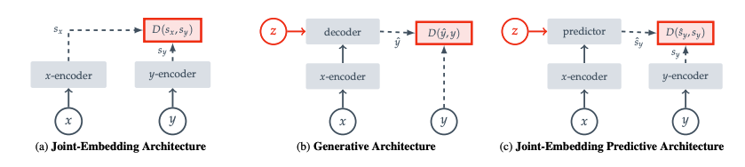
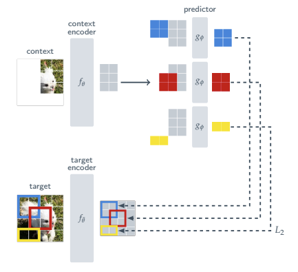
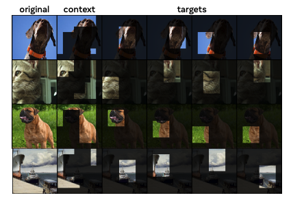
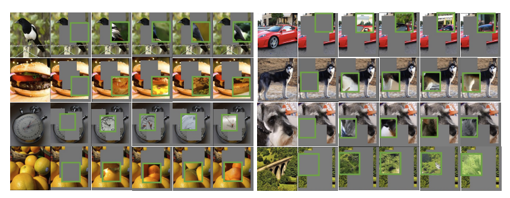

## I-JEPA Implementation in PyTorch

This repository contains an implementation of I-JEPA (Image-based Joint-Embedding Predictive Architecture) in PyTorch. I-JEPA is a self-supervised learning method that learns visual representations by predicting the representations of image regions from surrounding context regions.

### Paper Reference

This implementation is based on the paper:
- [I-JEPA: Joint-Embedding Predictive Architecture for Self-Supervised Learning](https://arxiv.org/pdf/2301.08243)

### Model Architecture

I-JEPA uses a Vision Transformer (ViT) architecture with:
- An online encoder network that processes context regions
- A target encoder network (momentum-updated) that processes target regions
- A predictor MLP that maps context embeddings to target embeddings

The model learns by predicting representations of masked image regions from surrounding context regions.

### Implementation Details

- Images are divided into non-overlapping patches
- Context and target regions are sampled as blocks of patches
- The predictor is trained to map context embeddings to target embeddings

### Images

*I-JEPA model architecture*

*Context and target regions sampling*

*Training process visualization*

*Performance comparison*

### References

- [Official I-JEPA Repository](https://github.com/facebookresearch/ijepa)
